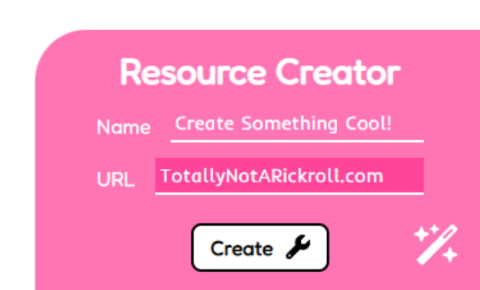

<h1 align="center">Resource Hub</h1>


<p align="center">
  <b>Everything. In one place.</b>
</p>

[](https://codeclimate.com/github/plani-hq/resources/maintainability)

## 📖 Prologue

My endeavours to keep up with the waves of homework have now subsided. It’s finally time for a better way to traverse through the arduous universe that is **SharePoint**. 

I’ve created a **resource hub** where anyone can instantly access and create new resources, allowing you to find homework, mark schemes, helpful videos… all in **one place!**

## 📷 Snapshots




## ✨ Features

- **Quick** and **intuitive** search algorithm
- **Minimalist** design
- _‘See All’_ page
- Resource creator

## 🏗️ Tools

- SQL
- SCSS
- JavaScript
- PHP
- Bootstrap
- Figma

## 💡 Stats
- **12** files
- **8** classes
- **2035** lines
- **2** days

## 🔧 Set-up

Tutorial on how to run PHP: [Medium](https://medium.com/@lostorto.business/how-to-run-php-with-xamp-d3318f7a7735).
	
1) **Clone** (download all the code from) the GitHub repository, either using **Git** or downloading as a ZIP file.
2) **Start** your Apache server.
3) **Make** the local repo the **server root** in '_httpd.conf_'.
4) **Open** '_localhost/nuast_' in your browser.
5) And **star** the repo 😄

## 📜 Credits

```python
class Developers:
    self.working = True

    def getDevelopers(self):
        return ['alexlostorto']
```
